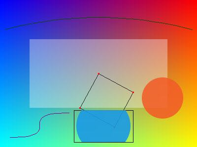

# mini-renderer

[](https://github.com/Gopal3746/mini-renderer/actions/workflows/ci.yml)

I built a small 2D software renderer from scratch in C++20, with no external rasterization libraries. The goal was to understand what a graphics library does under the hood, by building each stage of the pipeline by hand:

```
Scene                Transformations       Rasterizer              Framebuffer
  |                        |                     |                      |
  |-- Rectangle            |-- Translate         |-- Pixel coverage     |
  |-- Line                 |-- Rotate            |-- Clipping           |
  |-- Circle                \-- Scale            |-- Anti-aliasing      |
  \-- Bezier Path                                 \-- Alpha blending    |
                                                                          |
   \_______________________________________________________________ ---> RGBA framebuffer --> PNG
```



*Gradient background, a translucent filled rect, a rotated-and-scaled
square outline (via `Matrix3x3`), an anti-aliased circle, a quadratic
arc, a cubic S-curve, and a second circle restricted to a clip
rectangle — all drawn by this renderer, from one run of `mini_renderer`.*

## Features

- **Math primitives**: `Vec2`, `Color` (straight alpha), `Matrix3x3`
  (affine transforms via homogeneous coordinates — translate, rotate,
  scale, and composition)
- **Shapes**: axis-aligned rectangles, lines (Bresenham), circles,
  quadratic and cubic Bezier curves (flattened to polylines)
- **Rasterizer**: hard-edged rect/line fills, coverage-based
  anti-aliasing for circles (n×n subpixel supersampling), scissor-style
  rectangular clipping, Porter-Duff source-over alpha blending
- **Framebuffer**: RGBA8 buffer with PNG output via a vendored
  `stb_image_write`
- **Tests**: 26 unit tests (doctest) covering the math, the blend math,
  rasterizer edge-exactness, and Bezier curve endpoints
- **CI**: GitHub Actions matrix across Ubuntu and macOS, Debug (with
  ASan/UBSan) and Release, on every push
- **Performance experiment**: scalar vs ARM NEON SIMD alpha blending,
  see [Benchmark](#benchmark) below

## Build

Requires CMake 3.16+, a C++20 compiler, and (recommended) Ninja.

```bash
cmake -S . -B build -G Ninja -DCMAKE_BUILD_TYPE=Release
cmake --build build
```

## Run

```bash
./build/mini_renderer          # writes output.png
./build/tests/renderer_tests   # or: cd build && ctest --output-on-failure
./build/benchmarks/blend_benchmark
```

On ARM64 (Apple Silicon, or 64-bit ARM Linux), CMake automatically
detects the target and compiles `src/blend_neon.cpp`; the test suite
gains an extra NEON-vs-scalar correctness test, and the benchmark
prints real NEON timing instead of a "not available" message.

For a Debug build with AddressSanitizer/UndefinedBehaviorSanitizer
enabled (the default for Debug — see `RENDERER_ENABLE_SANITIZERS` in
`CMakeLists.txt`):

```bash
cmake -S . -B build-debug -G Ninja -DCMAKE_BUILD_TYPE=Debug
cmake --build build-debug
./build-debug/tests/renderer_tests
```

## Project layout

```
include/renderer/    Public headers: math (vec2, color, matrix3x3),
                      shapes, framebuffer, rasterizer, bezier, blend
src/                  Implementation for all of the above, plus main.cpp
                      (the demo program that produces output.png)
tests/                doctest-based unit tests, one file per module
benchmarks/           Scalar vs NEON blend benchmark
external/             Vendored single-header libraries (stb_image_write,
                       doctest) -- not this project's own code
.github/workflows/    CI: build + test matrix across OS and build type
```

## Design notes

A few choices worth knowing about if you're reading the code:

- **Straight, not premultiplied, alpha.** `Color` stores unpremultiplied
  RGBA floats. Easier to read and set by hand; premultiplied alpha is
  cheaper to composite and avoids dark fringing at AA edges, and would
  be the natural next thing to try.
- **Anti-aliasing is supersampling, not analytic.** `fill_circle`
  samples an n×n subpixel grid per boundary pixel and uses the inside
  fraction as coverage. An analytic signed-distance approach would be
  faster and is what production rasterizers tend to use; supersampling
  makes the concept of "coverage" directly visible in the code.
- **Bezier flattening is fixed-step, not adaptive.** `flatten()` always
  produces exactly N segments regardless of how curved the path is.
  Real rasterizers subdivide adaptively (more segments where curvature
  is high) based on a flatness tolerance.
- **Clipping gates writes, not reads.** `Framebuffer::set_clip_rect`
  restricts `set_pixel`/`set_pixel_raw`; `get_pixel` and `clear()` are
  unaffected, matching how a scissor test behaves in real graphics
  APIs.
- **`blend.hpp` is a second, narrower blend path**, separate from
  `Framebuffer::set_pixel`'s general source-over blend. It assumes an
  opaque destination and uses an *exact* integer divide-by-255 (the
  classic Blinn "Three Wrongs Make a Right" trick) rather than a float
  division — built specifically to give the scalar and NEON benchmark
  something identical and simple enough to compare fairly.

## Benchmark

`blend_benchmark` blends a 1920×1080 RGBA8 buffer over another, 100
times, with both the scalar and (where available) NEON implementations
of the same blend formula, and verifies their outputs match exactly
before printing any timing.

Measured on Apple Silicon (M-series Mac):

| Implementation | Time/iteration |
|---|---|
| Scalar | 1.0144 ms |
| NEON   | 0.4483 ms |

**Speedup: 2.26x**, with bit-exact correctness between the two paths.

That's a real speedup, but well short of the "16 lanes wide, so ~16x
faster" intuition SIMD width might suggest. The blend kernel does very
little arithmetic per pixel (one multiply-add and a shift) relative to
how much memory it touches — reading 8 bytes and writing 4 per pixel,
across ~2 million pixels, 100 times, is roughly 2.4 GB of total memory
traffic. At that point the bottleneck is memory bandwidth, not compute
throughput, and no amount of extra ALU parallelism fixes that — a
common finding in real SIMD optimization work, not a sign of a flawed
implementation.

## Tests

```bash
cd build && ctest --output-on-failure
```

26 test cases (25 on non-ARM builds, where the NEON correctness test
doesn't exist in the binary at all) covering `Vec2`/`Matrix3x3`/`Color`
math, `Framebuffer` construction/blending/clipping, rasterizer edge
exactness, Bezier endpoint interpolation, and the blend kernels.
